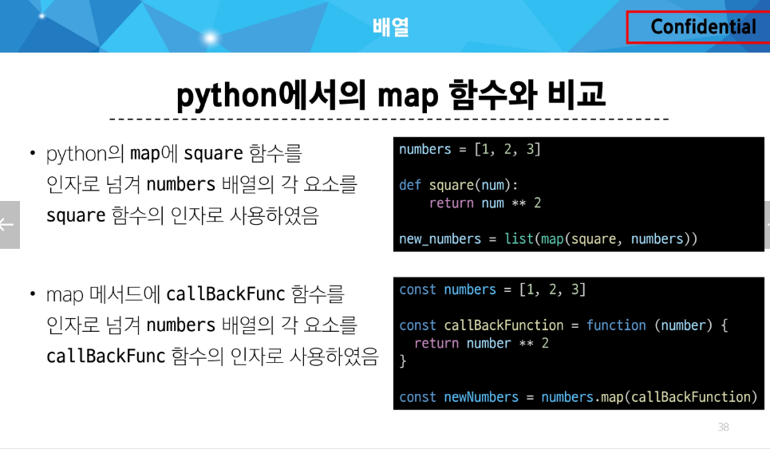
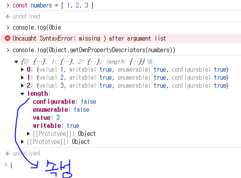

- 객체 : 키로 구분된 데이터 집합을 저장하는 자료형 (순서 없음)
  -> 이제는 순서가 있는 collection이 필요

자바스크립트는 이 객체를 기반으로 + 순서 를 넣는다.

=> Array 배열

## 배열

- 순서가 있는 데이터 집합을 저장하는 자료구조
- 배열에는 속성이 존재한다.

1. 배열구조

- 대괄호 [] 를 이용해서 작성
- 요소의 자료형은 제약 없음
- length 속성을 사용해 배열에 담긴 요소 개수 확인 가능

```javascript
const names = ["Alice", "Bella", "Cathy"];

console.log(names); // 배열자체 출력
// 콘솔에서 베열을 열어보면 키:벨류 형태로 객체형태이다. 왜냐면 배열은 객체에서 순서가 생긴거기떄문
// 순서가 부여돼서 length라는 속성이 존재한다.
console.log(names[0]); // Alice
console.log(names[1]); // Bella
console.log(names[2]); // Cathy

// 길이
console.log(names.length); // 3

// 수정
names[1] = "Dan";
console.log(names);
```

2. 주요 메서트
   - 1. `push` / `pop` : 배열 끝 요소를 추가/제거
   - 2. `unsift` / `sift` : 배열 앞 요소를 추가/제거

```javascript
const names = ["Alice", "Bella", "Cathy"];

// pop
console.log(names.pop()); // Cathy
console.log(names); // ['Alice', 'Bella']

// push
names.push("Dan");
console.log(names); // ['Alice', 'Bella', 'Dan']

// shift
console.log(names.shift()); // Alice
console.log(names); // ['Bella', 'Dan']

// unshift
names.unshift("Eric");
console.log(names); // ['Eric', 'Bella', 'Dan']
```

### Array helper method

- 배열 조작(이게 목적임) 을 보다 쉽게 수행할 수 있는 특별한 메서드 모음

- ES6에 도입 (중요한 버전!)
- 배열의 각 요소를 1. _순회_ 하며 각 요소에 대해 2. 함수**_(콜백함수)_**를 호출 💖 두가지 특성 잘 알아두기!!!
  - 메서드인데 반복문이다. 인자를 함수로 받는다.
- 대표 메서드
  - **_forEach(), map()_**, filter(), every(), some(), reduce()등
- ⭐메서드 호출 시 인자로 함수(콜백함수)를 받는 것이 특징⭐

#### 콜백 함수(Callback function)

- 다른 함수에 인자로 전달되는 함수

-> 외부 함수 내에서 호출되어 일종의 루틴이나 특정 작업을 진행

```python
# 99-callbock.py
numbers = [1, 2, 3]


def square(num):
    return num**2


new_numbers = list(map(square, numbers))
# map 함수의 특징 : 인자로 함수를 받을 수 있다.. square => 콜백함수이다.
# 이 numbers 를 돌면서 square 를 반복하며 적용하는거다. => 순회, 반복문
print(new_numbers)  # [1, 4, 9]
```

```javascript
// 1
const numbers1 = [1, 2, 3];
numbers1.forEach(function (number) {
  // forEach는 numbers라는 배열을 반복하면서 1, 2, 3 에 이 함수 functions() 를 적용시키는 거다.
  // 즉, function() 이 위의 코드 square의 역할인거다.
  // numbers 배열 요소하나하나를 콜백함수에 인자로 넘겨준다. 파이썬이랑 방향성이 반대다. ⭐
  console.log(number); // 3번 호출됨
});

// 2 위 코드랑 동일
// 콜백함수를 바깥쪽에 만들고 이름만 넣어주면 됨
const numbers2 = [1, 2, 3];
const callBackFunc = function (number) {
  console.log(number);
};
numbers.forEach(callBackFunc);
```

- 주요 Array Helper Methods

1. `forEach`

   - 배열 내의 모든 요소 각각에 대해 함수(콜백함수)를 호출
   - 반환 값 없음 ⭐

2. `map`
   - 배열 내의 모든 요소 각각에 대해 함수(콜백함수)를 호출
   - 함수 호출 결과를 모아 새로운 배열을 반환

#### `forEach()`

- 배열의 각 요소를 **_반복_**하며 모든 요소에 대해 함수(콜백함수)를 호출

1. `forEach` 구조

```
array.forEach(callback(item[, index[, array]]))
```

- 콜백함수는 3가지 매개변수로 구성

  - 1. `item` : 처리할 배열의 요소
  - 2. `index` : 처리할 배열 요소의 인덱스(선택 인자)
  - 3. `array` : `forEach`를 호출한 배열(선택 인자)

- 반환값
  - `undefined`

```javascript
array.forEach(fuction (item, index, array) {
    // do someting
})
```

```javascript
const names = ["Alice", "Bella", "Cathy"];

// 일반 함수 표기
names.forEach(function (name) {
  console.log(name);
});

// 화살표 함수 표기
names.forEach((name) => {
  console.log(name);
});

// 활용
names.forEach((name, index, array) => {
  console.log(name, index, array);
});

names.forEach((name, index) => {
  console.log(index); // index만 출력하고 싶더라도 첫번째인자 name은 같이 받아와야함
});
```

#### `map`

- 배열의 모든 요소에 대해 함수(콜백함수)를 호출하고, 반환 된 호출 결과 값을 모아 **_새로운 배열을 반환_**

- `map` 구조

```
array.map(callback(item[, index[, array]]))
```

- `forEach` 의 매개 변수와 동일

- 반환값
  - 배열의 각 요소에 대해 실행한 "callback의 결과를 모은 새로운 배열"
  - forEach 동작 원리와 같지만 forEach와 달리 새로운 배열을 반환함

```javascript
const newArr = array.map(fuction (item, index, array) {
    // do someting
})
// map 의 결과를 어떤 변수(newArr) 에 할당하고 있다.
// 만약 forEach였으면 반환값이 없으므로 undefined 가 나온다.!! 주의!!!
```

```javascript
// 1. for...of 와 비교
const persons = [
  { name: "Alice", age: 20 },
  { name: "Bella", age: 21 },
];

// 1.1 for...of
let result1 = [];
for (const person of persons) {
  result1.push(person.name);
}
console.log(result1); // ['Alice', 'Bella']

// 1.2 map
const result2 = persons.map(function (person) {
  return person.name;
});

console.log(result2); // ['Alice', 'Bella']

// 2. 화살표 함수 표기
const names = ["Alice", "Bella", "Cathy"];

const result3 = names.map(function (name) {
  return name.length;
});

const result4 = names.map((name) => {
  return name.length;
});

console.log(result3); // [5, 5, 5]
console.log(result4); // [5, 5, 5]

// 3. 커스텀 콜백 함수
const numbers = [1, 2, 3];
const myCallbackFunc = function (number) {
  return number * 2;
};

const doubleNumber = numbers.map(myCallbackFunc);

console.log(doubleNumber); // [2, 4, 6]
```



---

#### 배열 순회 종합

1. `for loop`
   - 배열의 인덱스를 이용하여 각 요소에 접근
   - break, continue 사용 가능
2. `for...of`
   - 배열 요소에 바로 접근 가능
   - break, continue 사용 가능
3. `forEach()` => 사용권장
   - 간결하고 가독성이 높음
   - callback 함수를 이용하여 각 요소를 조작하기 용이
   - break, continue 사용 불가

```javascript
// 배열 순회 종합
const names = ["Alice", "Bella", "Cathy"];

// for loop
for (let idx = 0; idx < names.length; idx++) {
  console.log(names[idx]);
}

// for...of
for (const name of names) {
  console.log(name);
}

// forEach
names.forEach((name) => {
  console.log(name);
});
```

- 기타 Array Helper Methods (MDN 문서를 참고해 사용해보기)

1. `filter` : *콜백 함수의 반환 값이 참*인 요소들만 모아서 새로운 배열을 반환
2. `find` : 콜백 함수의 반환 값이 참이면 해당 요소를 반환
3. `some`
   - 배열의 요소 중 적어도 하나라도 콜백 함수를 통과하면 true를 반환하며 즉시 배열 순회 중지
   - 반면 모두 통과하지 못하면 false를 반환
4. `every`
   - 배열의 모든 요소가 콜백 함수를 통과하면 true를 반환
   - 반면에 하나라도 통과하지 못하면 즉시 false를 반환하고 배열 순회 중지

### 배열 with '전개 구문'

- 배열 복사

```javascript
// 배열 복사 (with 전개 구문)
let parts = ["어깨", "무릎"];
let lyrics = ["머리", ...parts, "발"];

console.log(lyrics); // [ '머리', '어깨', '무릎', '발' ]
```

---

참고

### 콜백 함수

- 콜백함수를 사용하는 이유

1. 함수의 재사용성 측면

   - 함수를 호출하는 코드에서 콜백 함수의 동작을 자유롭게 변경할 수 있음
   - 예를 들어, map 함수는 콜백 함수를 인자로 받아 배열의 각 요소를 순회하며 콜백 함수를 실행
   - 이때, 콜백 함수는 각 요소를 변환하는 로직을 담당하므로, map 함수를 호출하는 코드는 간결하고 가독성이 높아짐

2. 비동기적 처리 측면
   cf. 동기 - 순차적 처리
   비동기 - 병렬적 처리 - setTimeout 함수는 콜백 함수를 인자로 받아 일정 시간이 지난 후에 실행 - 이 때, setTimeout 함수는 비동기적으로 콜백 함수를 실행하므로, 다른 코드의 밸싱을 방해하지 않음

```javascript
//  비동기적 처리
console.log("a");

setTimeout(() => {
  console.log("b");
}, 3000);

console.log("c");

// a, b, c 로 출력 될 것 같지만 a c b 로 나옴
```

---

### forEach에서 break 사용하기

- forEach에서 break 하는 대안
  - forEach에서는 break 키워드를 사용할 수 없음
  - 대신 some과 every의 특징을 활용해 마치 break 를 사용하는 것처럼 활용할 수 있음

```javascript
const array = [1, 2, 3, 4, 5];

// some
// - 배열의 요소 중 '적어도' 하나라도 콜백 함수를 통과하는지 테스트
// - 콜백 함수가 배열 요소 적어도 하나라도 참이면 true를 반환하고 순회 중지
// - 그렇지 않으면 false를 반환
const isEvenNumber = array.some(function (number) {
  return number % 2 === 0; //이게 참이라면 true를 반환하고 중단을 한다.
});

console.log(isEvenNumber); // true

// every
// - 배열의 '모든' 요소가 콜백 함수를 통과하는지 테스트
// - 콜백 함수가 모든 배열 요소에 대해 참이면 true를 반환
// - 그렇지 않으면 false를 반환하고 순회 중지

const isAllEvenNumber = array.every(function (number) {
  return number % 2 === 0;
});

console.log(isAllEvenNumber); // false
```

```javascript
// [forEach를 break 하는 대안]
// some과 every의 특징을 이용하여 마치 forEach에서 break를 사용하는 것처럼 구현할 수 있음
const names = ["Alice", "Bella", "Cathy"];

// 1. some
// - 콜백 함수가 true를 반환하면 some 메서드는 즉시 중단하고 true를 반환
// Bella 를 만나면 종료
names.some(function (name) {
  console.log(name);
  if (name === "Bella") {
    return true;
  }
  return false;
});

// 2. every
// - 콜백 함수가 false를 반환하면 every 메서드는 즉시 중단하고 false를 반환
names.some(function (name) {
  console.log(name);
  if (name === "Bella") {
    return false;
  }
  return true;
});
```

---

" 배열은 객체다 "

- 배열도 키와 속성들을 담고 있는 참조 타입의 객체
- 배열의 요소를 대괄호 접근법을 사용해 접근하는 건 객체 문법과 같음
  - 배열의 키는 숫자
- 숫자형 키를 사용함으로써 배열은 객체 기본 기능 이외에도 "순서가 있는 컬렉션" 을 제어하게 해주는 특별한 메서드르 제공하는 것

- 배열은 인덱스를 키로 가지며 length 속성을 갖는 특수한 객체


