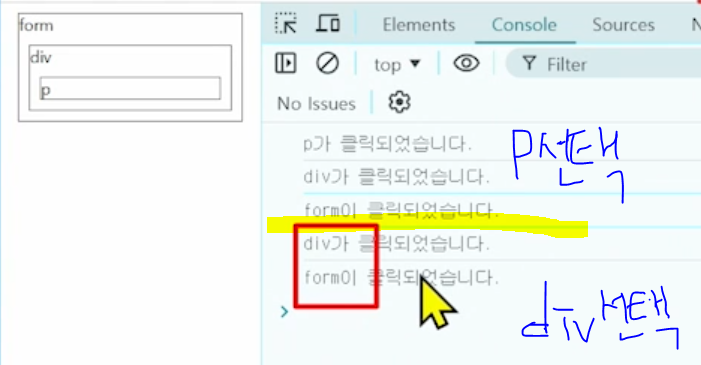
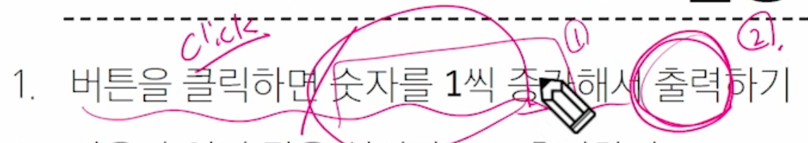
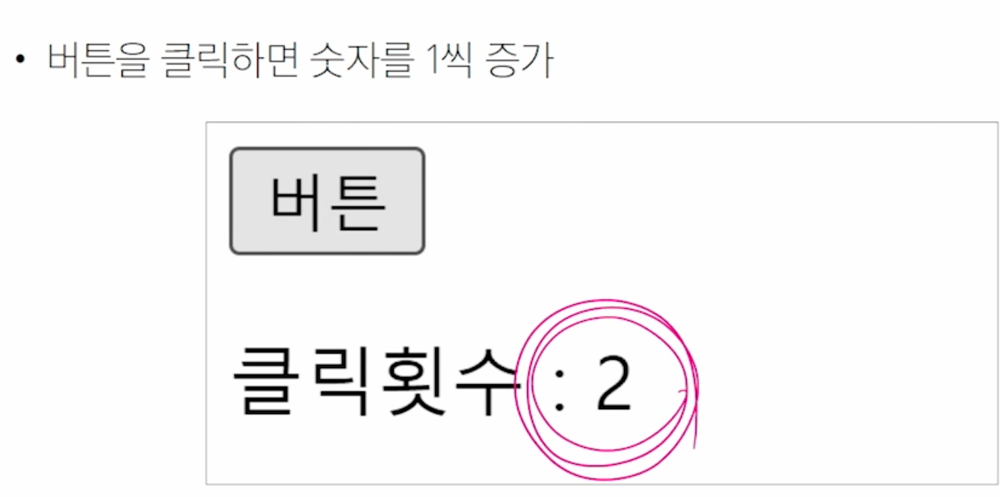
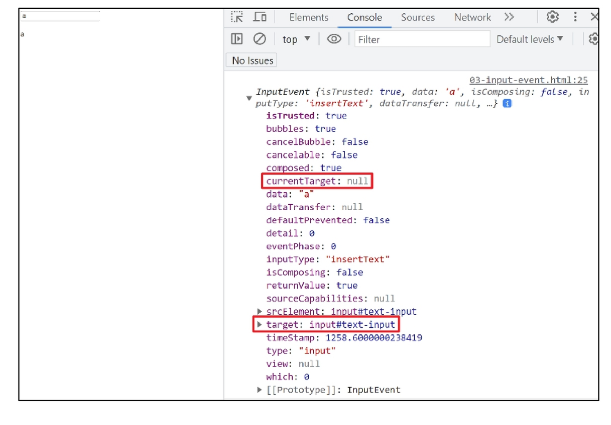
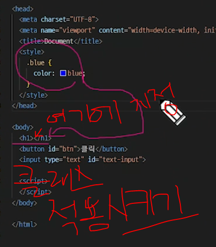

# Javascript 04 Controlling event

사용자의 행동에 따라 웹페이지를 조작
사용자와의 상호작용

# 이벤트

- event = 무언가 일어났다는 신호, 사건

- 모든 DOM 요소들을 event 를 발생 (이벤트를 잘 받아서 처리하면 조작을 할 수 있다는 뜻)

- DOM 요소에서 event가 발생하면, 해당 event는 연결된 이벤트 처리기(event handler)에 의해 처리 됨

## 'event' object

: DOM에서 이벤트가 발생했을 때 생성되는 객체

- 이벤트 종류
  - mouse, input, keyboard, touch ...

### event handler

- 특정 이벤트가 발생했을 때 실행되는 함수

: 사용자의 행동에 어떻게 반응할지를 JavaScript 코드로 표현한 것.

- event handler 의 메서드
  => .addEventListener()
  대표적 이벤트 핸들러 중 하나

  -> 특정 이벤트를 DOM 요소가 수신할 때마다 콜백 함수를 호출

`EventTarget.addEventListener(type, handler)`

- <span style="color:red ">EventTarget : DOM 요소</span>
- <span style="color:green ">type : 수신할 이벤트</span>
- <span style="color:aqua ">handler : 콜백 함수</span> (할일)

"<span style="color:red ">대상</span> 에
<span style="color:green ">특정 Event</span> 가 발생하면,
<span style="color:aqua ">지정한 이벤트를 받아 할 일</span>을 등록한다."

#### addEventListener의 인자

.addEventListener(<span style="color:green">type</span>, <span style="color:aqua">handle</span>)

```javascript
element.addEventListener("click", function (event) {
  //이벤트 처리 로직
});
```

- type
  - 수신할 이벤트 이름
  - **_문자열_**로 작성 (ex. 'click') 💖💖
- handler
  - 발생한 이벤트 객체를 수신하는 콜백 함수
  - 이벤트 핸들러는 "자동"으로 **_event객체를 매개변수_**로 받음

#### addEventListener의 활용

- "버튼을 클릭하면 // => event

  버튼 요소 출력하기 // => handler"

- 버튼에 이벤트 처리기를 부착하여 클릭 이벤트가 발생하면
  이벤트가 발생한 버튼정보를 출력

#### addEventListener의 콜백함수의 특징

- 이벤트 핸들러 내부의 this는 이벤트 리스너에 연결된 요소(currentTarget)를 가리킴
- 이벤트가 발생하면 event 객체가 생성되어 첫 번째 인자로 전달
  - event 객체가 필요 없는 경우 생략 가능
- 반환값 없음

```javascript
// 1. 버튼 선택 (어디에 붙일지를 선택해야함)
const btn = document.querySelector("#btn");

// 2. 콜백 함수
const detectClick = function (event) {
  console.log(event);
  // 이 3개가 반드시 항상 동일하지는 않다.
  // currentTarget 이 this이고
  // target은 상황에 따라 변경될 수도 있다.
  console.log(event.currentTarget);
  console.log(event.target);
  console.log(this);
};

// 3. 버튼에 이벤트 핸들러를 부착
btn.addEventListener("click", detectClick);
// EventListener 의 동작 방식에 좀더 집중하자.
```

---

target과 currentTarget 왜 두개가 존재하는지
버블링을 통해 알아보자!

#### 버블링

- 버블링 개요
  - form > div > p 형태의 중첩된 구조에 각각 이벤트 핸들러가 연결되어 있을 때 만약 <p> 요소를 클릭하면 어떻게 될까?



- <p> 요소만 클릭했는데도 불구하고 모든 핸들러가 동작함
  -> 왜 p만을 클릭했는데 부모 요소 div와 form에 할당된 핸들러까지 동작할까?

- 버블링(Bubbling)
  - "한 요소에 이벤트가 발생하면, 이 요소에 할당된 핸들러가 동작하고, 이어서 부모 요소의 핸들러가 동작하는 현상"
  - 가장 최상단의 조상 요소(document)를 만날 때까지 이 과정이 반복되면서 요소 각각에 할당된 핸들러가 동작
  - 이벤트가 제일 깊은 곳에 있는 요소에서 시작해 부모 요소를 거슬러 올라가며 발생하는 것이 마치 물속 거품과 닮았기 때문
  - 최하위의 <p> 요소를 클릭하면 p -> div -> form 순서로 3개의 이벤트 핸들러가 모두 순차적으로 동작했던 것

=> 버그가 아니라 의도적인 설정!

=> 이벤트가 정확히 어디서 발생했는지 접근할 수 있는 방법!

event.<span style="color:red">currentTarget</span>
event.<span style="color:red">target</span>
이 버블링 현상을 통해서 위의 두가지는 다른 결과를 도출한다.

`currnetTarget` & `target`

- `currnetTarget` 속성

  - '현재' 요소
  - 항상 이벤트 핸들러가 연결된 요소만을 참조하는 속성
  - `this` 와 같음

- `target` 속성
  - 이벤트가 발생한 가장 안쪽의 요소 (target)를 참조하는 속성
  - 실제 이벤트가 시작된 요소
  - 버블링이 진행 되어도 변하지 않음


- 여기서 계속 변경되는 값은 `target` 이다.
  `target` 은 실제로 클릭된 곳. 실제로 이벤트가 발생한 곳을 보여준다.!

- `outerOuterElement.addEventListener('click', clickhandler)`
  이벤트리스너(addEvnetListener)가 부착된 대상.
  즉 위에서는 `outerOuterElement` 이다.
  (아래코드 참조)

```javascript
<body>
  <div id="outerouter">
    outerouter
    <div id="outer">
      outer
      <div id="inner">inner</div>
    </div>
  </div>

  <script>
    const outerOuterElement = document.querySelector('#outerouter')
    const outerElement = document.querySelector('#outer')
    const innerElement = document.querySelector('#inner')

    const clickHandler = function (event) {
      console.log('currentTarget:', event.currentTarget.id)
      console.log('target:', event.target.id)
    }

    outerOuterElement.addEventListener('click', clickHandler) //✔
  </script>
</body>
```

- 핸들러는 outerouter에만 연결되어 있지만 하위 요소 outer와 inner를 클릭해도 해당 핸들러가 동작함
- 클릭 이벤트가 어디서 발생했든 상관없이 outerouter까지 이벤트가 버블링되어 핸들러를 실행시키기 때문

---

#### 캡처링과 버블링

- 캡처링은 버블링과 반대현상(딱히 중요하진 않음)
- 이벤트가 하위 요소로 전파되는 단계

- `table` 의 하위요소 `td`를 클릭하면 이벤트는 먼저 최상위 요소로부터 아래로 전파됨(캡처링)
- 실제 이벤트가 발생한 지점(event.target)에서 실행된 후 다시 위로 전파 (버블링)
  - 이 전파 과정에서 상위 요소에 할당된 이벤트 핸들러들이 호출되는 것

-> 캡처링은 실제 개발자가 다루는 경우가 거의 없으므로 버블링에 집중하기

#### 버블링의 필요성

- 만약 다음과 가티 각자 다른 동작을 수행하는 버튼이 여러 개가 있다고 가정.
- 그렇다면 각 버튼마다 서로 다른 이벤트 핸들러를 할당해야 할까? 어떻게 해야 할까 ?
- 우리가 해결해야하는것 : `어떤 버튼이 눌렸는지만 알면 됨!`
  ===> 각 버튼의 <span style="color:aqua">공통 조상인 div 요소에 이벤트 핸들러 단! 하나만 할당하기</span>

(99-bubblint-example.html)

#### 버블링이 필요한 이유

- 요소의 공통 조상에 이벤트 핸들러를 단 하나만 할당하면, 여러 버튼 요소에서 발생하는 이벤트를 한꺼번에 다룰 수 있음
- 공통 조장에 할당한 핸들러에서 event.target 을 이용하면 실제 어떤 버튼에서 이벤트가 발생했는지 알 수 있기 때문

---

#### event handler 활용 실습

1. 버튼을 클릭하면 숫자를 1씩 증가해서 출력하기
   
   
2. 사용자 입력 값을 실시간으로 출력하기
3. 사용자 입력 값을 실시간으로 출력하기 + 버튼을 클릭하면 출력된 값의 CSS 스타일을 변경하기
4. todo 프로그램 구현
5. 로또 번호 생성기 구현

```javascript

<body>
  <button id="btn">버튼</button>
  <p>클릭횟수 : <span id="counter">0</span></p>

  <script>
    // 1. 초기값
    let countNumber = 0

    //2. 버튼 요소 선택
    const btn = document.querySelector('#btn')


    //3. 이벤트 핸들러의 콜백 함수
    const clickHandler = function (event) {
      // 3.1 초기값을 +1 증가
      countNumber += 1

      // 3.2 숫자를 콘텐츠로 가지고 있는 span 태그 선택
      const spanTag = document.querySelector('#counter')


      // 3.3 span 태그의 콘텐츠 값을 countNumber 값으로 할당(변경)
      spanTag.textContent = countNumber
    }


    //4. 선택한 버튼에 이벤트 핸들러 부착
    btn.addEventListener('click', clickHandler)
  </script>
```

---

#### input 이벤트 활용 실습

- 사용자의 입력 값을 실시간으로 출력하기

```javascript
<body>
    <!-- 데이터는 input 태그 안에서 채워지고 있다. -> 결국 input태그 선택
   -> 밑에 event 객체가 발생할 4번의 inputTag를 선택해야한다.
   어떻게 해야할까 ?!
   방법이 2가지가 있음
    1. console.log(event.currentTarget) 이벤트 객체가 부착된 대상 : current
    2. console.log(this)-->
    <input type="text" id="text-input" />

    <p></p>

    <script>
      // 1. input 요소를 선택하기 (이벤트가 발생하는 지점)
      const inputTag = document.querySelector("#text-input");
      // 2. p 요소 선택
      const pTag = document.querySelector("p");
      //3. 콜백 함수 (input 요소에 input 이벤트가 발생할 때 마다 실행될 코드 )
      const inputHandler = function (event) {
        // 3.1 이벤트 객체에서 사용자가 입력한 값을 찾아 저장
        // console.log(event);
        // console.log(event.currentTarget);
        // console.log(this);
        console.log(event.currentTarget.value);
        // const inputData = this.value 로 해도 동일하다 근데 this는 주의해야한다.
        // this는 이 함수가 일반함수로 호출되느냐 화살표함수로 호출되느냐에 따라 다르다. 100프로 동일하진 않음
        const inputData = event.currentTarget.value;

        // 3.2 선택한 p요소의 텍스트 콘텐츠에 할당
        pTag.textContent = inputData;
      };
      //4. 선택한 input 요소에 이벤트 핸들러를 부착
      inputTag.addEventListener("input", inputHandler);
    </script>
  </body>
```

- `currentTarget` 주의사항
  - `console.log()` 로 event 객체를 출력할 경우 `currentTarget`키의 값은 `null`을 가짐
  - `currentTarget`은 이벤트가 처리되는 동안에만 사용할 수 있기 때문
  - 대신 `console.log(event.currentTarget)`을 사용하여 콘솔에서 확인 가능
  - `currentTarget`이후의 속성 값들은 <span style="color:red">'target'을 참고해서 사용하기</span>  
    

#### click & input 이벤트 실습

- 사용자의 입력 값을 실시간으로 출력
- 여기에 버튼을 클릭하면 출력한 값의 CSS 스타일을 변경하기



#### todo 실습

- 입력하면서 + 리스트 태그 생성하면서 + 추가
- 사용자 입력 데이터 받기
- 클릭 이벤트가 발생하면 -> 리스트 태그 하고 내용채우고 ul 태그에 자식으로 추가한다.

- todo 추가 기능 구현
  1. 빈 문자열 입력 방지
  2. 입력이 없을 경우 경고 대화상자를 띄움

`trim()`
input데이터의 빈공백을 다 지움 지우고 나서 true로 평가를 받는다면 = 즉, 빈문자열이 아니라면
근데 빈공백을 다 지웠음에도 false로 평가를 받는다면 빈문자로 평가한거다.
