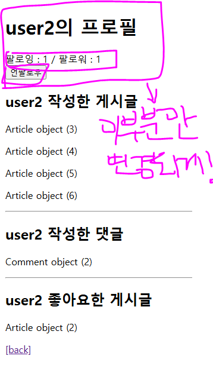
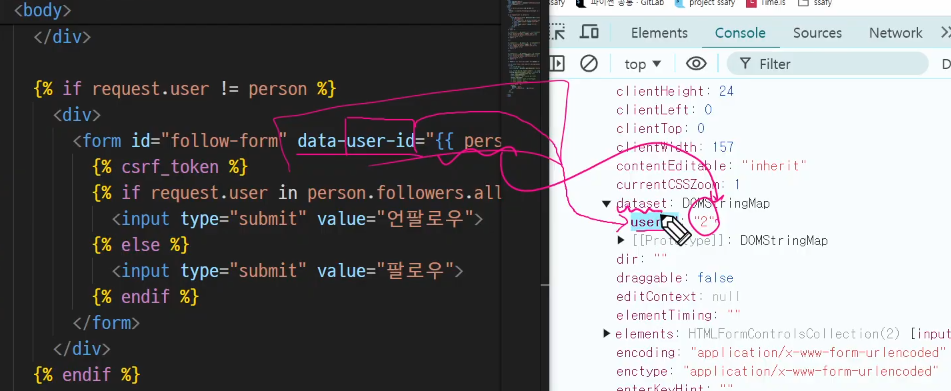

# JavaScript 06

# Ajax with Django

## Ajax (Asynchronous JavaScript and XML)

- 비동기적인 웹 애플리케이션 개발에 사용하는 모든 기술들 통칭
- 특정 기술을 말하는 것은 아님

- XHR 객체(자스가 생성하는 객체)를 생성해서 여기에 요청을 보내야 비동기적으로 서버와 소통을 할 수 있다.

- XHR 객체 생성 및 요청(클라이언트) -> Ajax 요청처리(서버) -> 응답 데이터 생성 -> JSON 데이터 응답 -> Promise객체 데이터를 활용해 DOM조작(웹페이지의 일부분 만을 다시 로딩)

- AXIOS 라는 라이브러리 와 Ajax 용어 잘 구분하기!!! 💖

- Promise의 특징(성공에 대한 메서드와 실패에 대한 메서드 나눠서 진행)
  - 성공에 대한 결과 : then()을 통해 콜백함수 실행
  - 실패에 대한 결과 : catch()

-비동기 콜백을 할 때 문제점(단점) - 병렬적으로 일을 하는 것은 좋지만 이 병렬적인 일들의 순서가 불명확하다
=> 해결점 : Promise방식 then()이 계속해서 체인되는 형태로 진행가능
앞선 then()의 결과가 뒤의 then()의 콜백함수의 인자로 전달됨, 성공에 대한 로직을 디테일하게 나눠서 진행가능 - 전체를 갱신하지않고 일부분만 로딩할 수 있는 것을 학습함

---

---

- 장고과 js 함께 상용하기

## Ajax with follow

- 팔로우 버튼만 눌러도 페이지 전체를 다시 리다이렉트 받아야하는 현상이 일어남
=> 이것을 자바스크립트의 비동기적으로 해결해보자

 
팔로우 버튼과 위의 팔로우 수만 바뀌도록!

1. Ajax 적용
- 프로필 페이지에서 axios CDN 작성하기

- 기존 : HTML 의 form태그를 사용해서 POST 메서드로 데이터를 제출(submit)
- 변경 
  - axios 를 사용해 POST 메서드로 데이터를 제출 
  - form의 method, action 속성이 불필요 (axios에서 대체 가능하기 때문)
  - 팔로우 버튼에 submit 이벤트가 발생하면 (이벤트 리스너)
  - django가 json 데이터를 응답 
  - JS 에서 json 응답받은 json 데이터를 활용해 팔로우 버튼을 조작 (DOM)
  
  